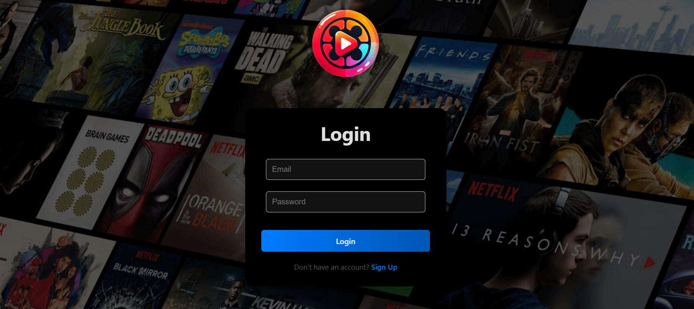
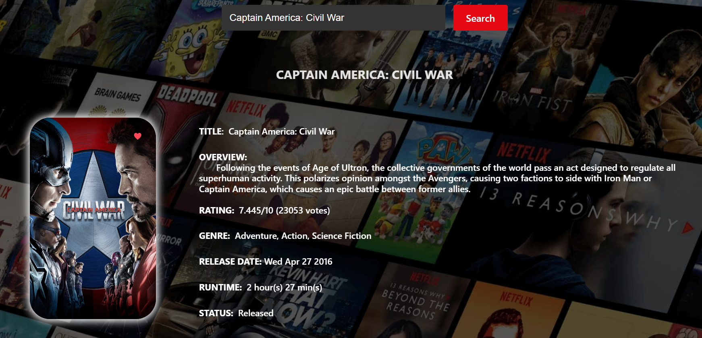
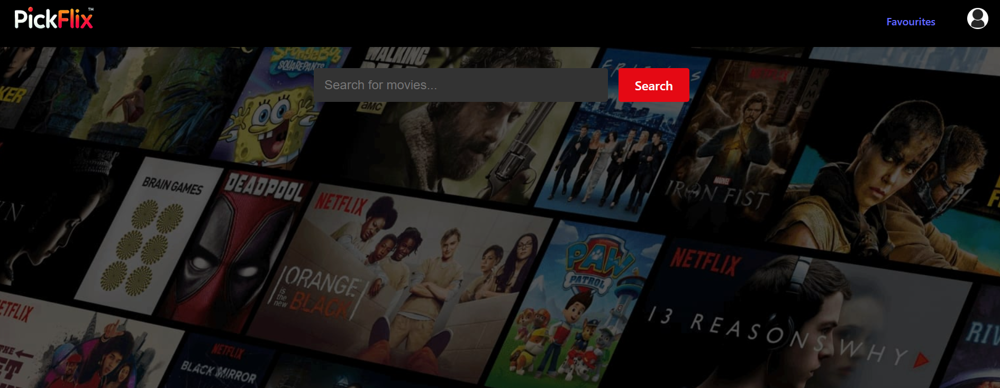
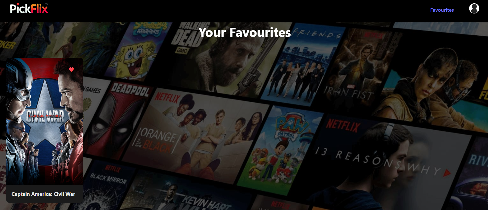

# PickFlix: Movie Recommendation System 🎬✨

Welcome to **PickFlix**, an AI-powered movie recommendation system that not only helps you discover your next favorite film but also provides a secure, personalized experience for every user.

---

## 🚀 Overview

PickFlix uses advanced machine learning algorithms (such as cosine similarity and count vectorization) to recommend movies based on your preferences. The system also provides:
- **AI-Powered Recommendations:** Discover films similar to your favorites.
- **Secure User Authentication:** Log in using your email and password with JWT-based security.
- **Movie Details & Trailers:** Explore detailed movie info, top cast profiles, and watch trailers directly within the app.
- **Responsive Web Interface:** Built with React & Vite for a dynamic user experience.

---

## 📸 Screenshots

### 🔐 Login Page


### 🏠 Home Page
  


### 🔍 Search Page


### ❤️ Favorites


### 🎯 Recommendations


## 🔥 Key Features

- **Personalized Movie Recommendations**  
  Leverages machine learning to analyze your movie tastes and provide tailored suggestions.

- **Email-Based Secure Authentication**  
  Users register with a unique email (case-insensitive) . Log in seamlessly using your email.  
  *(Note: Registration and authentication logic enforce unique emails.)*

- **Dynamic Trailer Integration**  
  Fetch and display YouTube trailers for each movie using the [movie-trailer](https://www.npmjs.com/package/movie-trailer) npm package.

- **Comprehensive Movie Details**  
  Get information on the movie’s overview, rating, genres, release date, runtime, and more—plus a list of top cast members and related recommendations.

- **Real-Time Updates**  
  Your favorites list is updated immediately upon login or when you add or remove a movie, ensuring a smooth experience.

---

## 💻 Technologies Used

- **Backend:**  
  - Python & Django  
  - Django REST Framework  
  - JWT Authentication via SimpleJWT  
  - Pandas, scikit-learn for similarity & recommendation algorithms

- **Frontend:**  
  - React & Vite  
  - Axios for API calls  
  - movie-trailer npm package for fetching trailers

- **Deployment:**  
  - Choreo Cloud Platform for backend deployment

---

## 🔐 Environment Variables

### Backend (.env)
Create a file called `.env` in the **backend** folder and include:
```env
SECRET_KEY=your_django_secret_key
TMDB_API_KEY=your_tmdb_api_key

### Frontend (.env)
Create a file called `.env` in the **frontend** folder and include:
```env
VITE_BACKEND_URL=http://localhost:8000
```
*Remember: Restart your development servers after modifying `.env` files!*

---

## ⚙️ Getting Started

### 1. Clone the Repository
```bash
git clone https://github.com/yourusername/movie-recommendation-system.git
```

### 2. Install Backend Dependencies
```bash
cd backend
pip install -r requirements.txt
```

### 3. Install Frontend Dependencies
```bash
cd frontend
npm install
```

### 4. Run the Django Backend
In the backend folder:
```bash
python manage.py runserver
```

### 5. Run the React + Vite Frontend
In the frontend folder:
```bash
npm run dev
```

### 6. Access the Application
- **Local Version:** Open your browser at `http://localhost:3000` (or the URL specified by Vite).
- **Deployed Version:** The system is deployed on Choreo. You can access the live version :- https://64078db8-2ccd-4a07-ac83-56b1ddb7efd9.e1-us-east-azure.choreoapps.dev

---

## 🔑 Authentication Flow

### Registration
- **Endpoint:** `POST /api/user/register/`
- **Payload Example:**
  ```json
  {
    "username": "goku",
    "email": "goku@gmail.com",
    "password": "yourpassword"
  }
  ```

### Login
- **Endpoint:** `POST /api/login/`
- **Payload Example:**
  ```json
  {
    "email": "goku@gmail.com",
    "password": "yourpassword"
  }
  ```

- **Response:**  
  ```json
  {
    "access": "JWT_ACCESS_TOKEN",
    "refresh": "JWT_REFRESH_TOKEN"
  }
  ```

---

## 📢 API Endpoints

- `POST /api/user/register/` – User registration
- `POST /api/login/` – Email-based login
- `POST /api/token/refresh/` – JWT refresh
- `GET /api/favourites/` – Fetch user's favorites
- `POST /api/favourites/add_favourite/` – Add a favorite
- `DELETE /api/favourites/<movie_id>/` – Delete a favorite

---

## 🌱 Additional Notes

- Environment variables stored in `.env` files.
- Trailer fetched dynamically via `movie-trailer` npm.
- Favorites handled using React Context.
- Deployed on Choreo or any cloud service.

---

## 🤝 Contributing

Contributions are welcome! Feel free to open issues or pull requests.

---